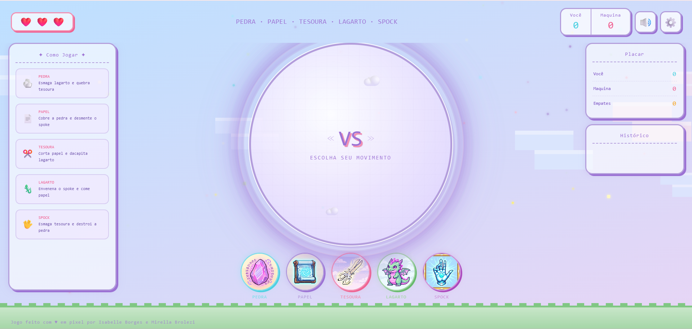
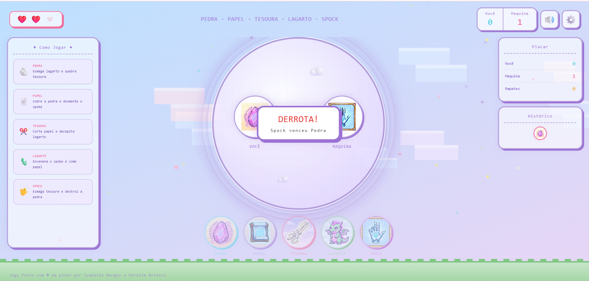
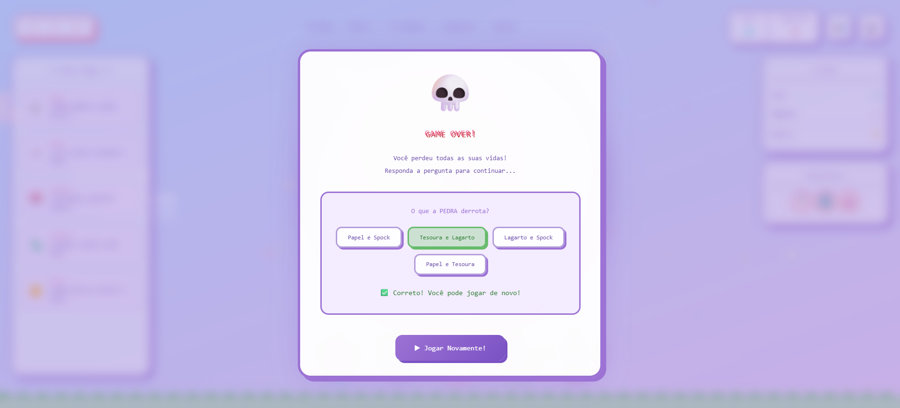

# 🕹️ Pedra, Papel, Tesoura, Lagarto e Spock 

Um jogo clássico e expandido de "Pedra, Papel, Tesoura, Lagarto e Spock" desenvolvido com estética retrô de **Pixel Art**, interface fluida e geração de áudio nativa por código.

---
## 🌐 Jogue Agora

Você pode testar e se divertir com o jogo diretamente pelo seu navegador clicando no link:

👉 **[Clique aqui para acessar o jogo]([https://isabelleborges26.github.io/Magic_Play/])**

---
## 📸 Demonstração do Projeto

| Tela de Escolha | Confronto | Quiz de Recuperação |
| :---: | :---: | :---: |
|  |  |  |

---
## 🛠️ Tecnologias Utilizadas

O projeto foi construído utilizando apenas tecnologias web nativas, sem a dependência de bibliotecas ou frameworks externos:

* **HTML5:** Estruturação semântica e suporte à renderização de elementos gráficos.
* **CSS3:** Design responsivo, paleta de cores pastel e animações de movimento.
* **JavaScript:** Lógica do jogo, manipulação do DOM e processamento de efeitos.

---

## 🚀 Funcionalidades e Diferenciais Técnicos

### 🎵 1. Engenharia de Som (Web Audio API)
* **Síntese de Áudio Pura:** O jogo **não carrega arquivos externos de áudio (como .mp3 ou .wav)**. Todos os sons são sintetizados matematicamente em tempo real pelo navegador.
* **Osciladores Retrô:** Uso de nós de osciladores nativos (`createOscillator()`) configurados com ondas do tipo `square` (quadrada) e `sawtooth` (dente de serra), simulando os chips de áudio de consoles 8-bit (como Game Boy e NES).
* **Trilha Dinâmica:** Funções dedicadas para reprodução de música de fundo (BGM) em loop e efeitos sonoros (SFX) contextuais para cliques, vitórias e derrotas.

### ☁️ 2. Fundo Animado por Código (Canvas + CSS)
* **Nuvens em Matriz:** As nuvens de pixel art são geradas dinamicamente via script através da API **HTML5 Canvas**, garantindo um carregamento ultraleve e livre de imagens pesadas.
* **Camadas de Animação:** O movimento contínuo do cenário, o piscar das estrelas e o flutuar das faíscas são gerenciados por animações CSS otimizadas (`@keyframes`), gerando profundidade visual.

### 🖥️ 3. Design Fluido e Estética Pixelada
* **Propriedade de Renderização:** Aplicação do atributo `image-rendering: pixelated;` no CSS para desativar a suavização padrão do navegador, mantendo os contornos das artes em pixels perfeitamente nítidos em qualquer tela.
* **Responsividade com `clamp()`:** Uso estratégico da função matemática `clamp(mínimo, ideal, máximo)` nas fontes e dimensões de componentes, permitindo que a interface se adapte organicamente desde celulares pequenos até monitores Desktop de alta resolução.

### 🎮 4. Experiência do Usuário (UX) e Game Loop
* **Feedback de Impacto:** O sistema de vidas (corações) inclui uma animação de tremor (`.shake`) que é disparada temporariamente ao sofrer dano.
* **Efeitos de Partículas:** Emissores dinâmicos de confetes e corações via script para celebrar os momentos de vitória do jogador.
* **Mecânica de Recuperação:** Sistema de quiz integrado no final do jogo, oferecendo uma chance extra de continuar a partida caso o jogador responda corretamente.

---

## 📂 Estrutura do Código

* `index.html`
* `script.html`
* `style.html`

---

## 🔧 Como Executar o Projeto

1. Faça o download ou clone este repositório.
2. Abra o arquivo `index.html` diretamente em qualquer navegador moderno (Chrome, Firefox, Edge, Safari).
3. Divirta-se! 🎮

---

## 🩷 Feito por: Isabelle Borges e Mirella Brolezi
